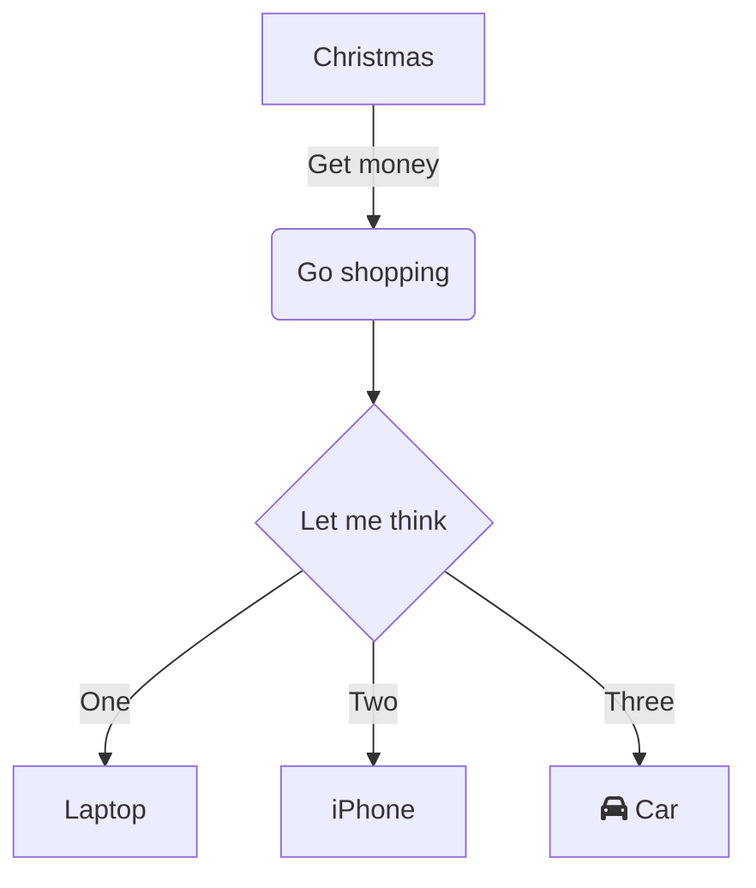

# Les diagrammes

Pour ceux qui veulent éviter de passer par un logiciel, il est possible, car à **Mermaid**, un outil JavaScript qui génère dynamiquement des diagrammes et des graphiques en se basant sur des définitions Markdown.  

Dans ce cas une iframe et générée, elle contient la syntaxe **Mermaid**, puis la librairie **Mermaid.js** la transforme en diagramme directement dans le navigateur.

```
marquer le début du diagramme -> ```mermaid
Type de graph ou de diagramme -> graph TD;
Les infos en syntaxe mermaid  -> A-->B;
                                 A-->C;
                                 B-->D;
                                 C-->D;
Fin du bloc                   -> ```
```
Résultat :

Il existe de nombreuses possibilités :


Comme les diagrammes de séquences par exemple. 

La [documentation](https://mermaid.js.org/ "doc de Mermaid.js") de Mermaid.js détaille les possibilités, ce [site](https://mermaid.live/ "Mermaid Live Editor") permet de tester la syntaxe. Le [dépôt](https://github.com/mermaid-js/mermaid "dépôt de Mermaid") de Mermaid et celui de [Mermaid.js](https://github.com/mermaid-js/ "dépôt de Mermaid.js") pour en apprendre plus.